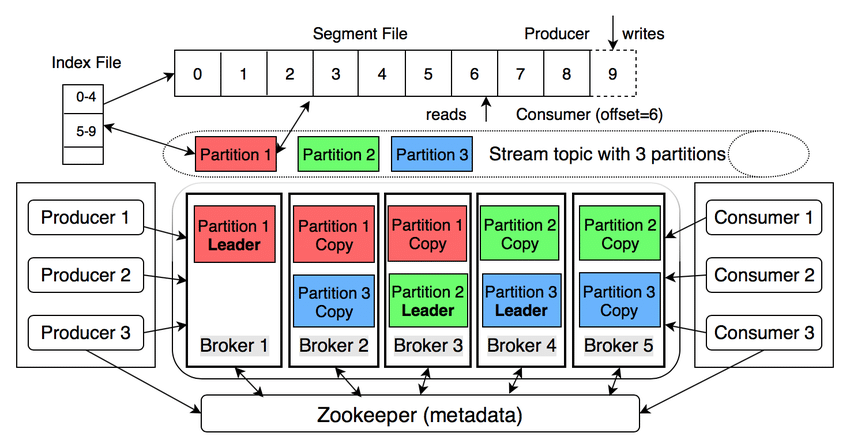
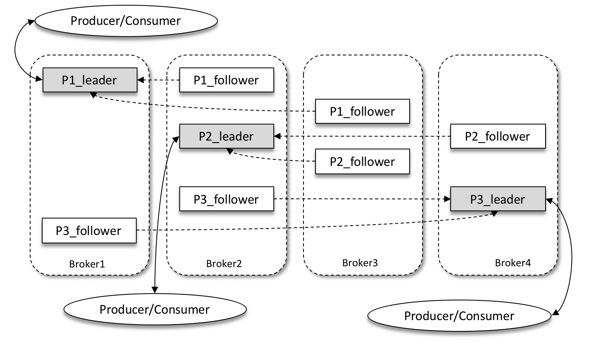
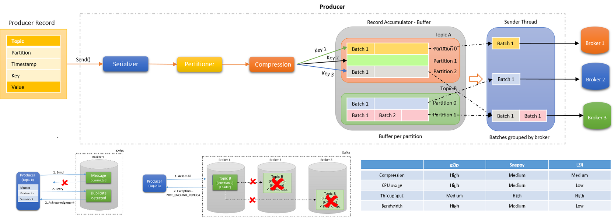
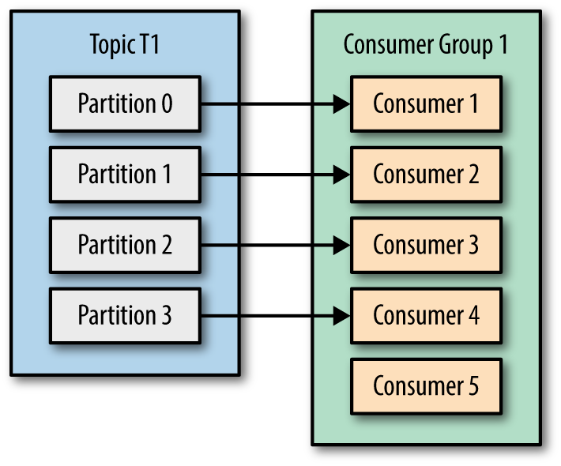
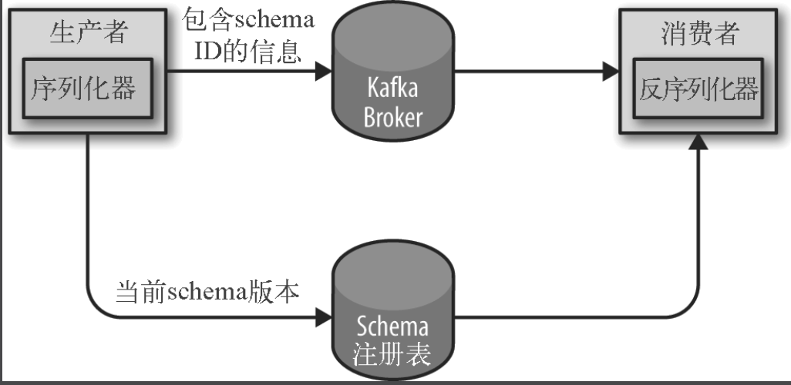

分布式系统中，Kafka 的多个 Client（Consumer 或 Producer） 或 Broker 运行在不同的服务器、容器？上，本地测试时可以用线程代替。
  
## Introduction
Kafka 基于事件（Event）概念。  
  
  
  
## Topic
每个 Event 都归属于某个 Topic（同类 Event 的容器，就如关系数据库的 Table 概念），单个 Event 也可以同时归属于多个 Topic。  
每个 Topic 都是 Event 的 durable Log（存放在硬盘上的日志文件）而不是队列（Queue，因此不同于一般消息队列软件），这也是为什么 Kafka Queue 这种称呼不准确。Log 是一种简单的数据结构，只能 append 不能中间插入，读取时只能通过 offset 查找而不是 index，而且 Event Log 是 immutable（因为生活中一个事件发生了就不可改变），Log 也使得更好的吞吐性能成为了可能也使得 Message 过期设置（比如 2 周或永不过期）成为可能。  

**一个主题（Topic）可以有多个键（Key），多个消息可以使用相同的主题（Topic）+ 键（Key）。**  
  
## Partitioning
**一个主题（Topic）可以有多个分区（Partition），但一个分区（Partition）只属于一个主题（Topic）。**  

由于经济、系统设计的原因（比如单个 Topic 数据量太大，但是企业想省钱继而希望使用多个小节点而不是一个大节点），Partitioning - 把单个 Topic 的 Log 分割成多个 Log（Partition），它们可以被分布分配在 Kafka 集群的一个个独立的节点上。当新消息 Message 来临时，应该写入哪个 Partition 有多种算法选择，比如 Round Robin（消息没 Key）、哈希后对 Partition 总数取余（消息有 Key）等等，这些方法总是能保证单个 Partition 上该 Topic 的 Message 总是按写入顺序排序的（单个 Partition 上不一定顺序紧密相连因为中间的可能分布到其他 Partition，但是单个 Partition 上的总是单调顺序的比如 1、3、5）。  
每个主题（Topic）的消息有不同的分区，这样一方面消息的存储就不会受到单一服务器存储空间大小的限制，另一方面消息的处理也可以在多个服务器上并行。  

ProducerRecord 对象包含了目标主题、键和值。Kafka 的消息是一个个键值对，ProducerRecord 对象可以只包含目标主题和值，键可以设置为默认的 null，不过大多数应用程序会用到键。键有两个用途：可以作为消息的附加信息，也可以用来决定消息该被写到主题的哪个分区（Partition）。拥有相同键的消息将被写到同一个分区。也就是说，如果一个进程只从一个主题的分区读取数据，那么具有相同键的所有记录都会被该进程读取。  
如果键值为 null，并且使用了默认的分区器，那么记录将被随机地发送到主题内各个可用的分区上。分区器使用轮询（Round Robin）算法将消息均衡地分布到各个分区上。  
如果键不为空，并且使用了默认的分区器，那么 Kafka 会对键进行散列，然后根据散列值把消息映射到特定的分区上。这里的关键之处在于，同一个键总是被映射到同一个分区上。  
只有在不改变主题分区数量的情况下，键与分区之间的映射才能保持不变。一旦主题增加了新的分区，这些就无法保证了 —— 旧数据仍然留在原分区，但新的记录可能被写到其他分区上。如果要使用键来映射分区，那么最好在创建主题的时候就把分区规划好，而且永远不要增加新分区。  
**Kafka 除了提供了默认分区器，使用者也可以实现自定义分区策略（自己写类 implements Partitioner）。**[注意分区策略会影响消费顺序。](./README.md#消费顺序)  

### 物理存储
Kafka 的基本存储单元是分区。分区的大小受到单个挂载点可用空间的限制。日志压缩是 Kafka 的一个高级特性，因为有了这个特性，Kafka 可以用来长时间地保存数据。  

保留数据是 Kafka 的一个基本特性，Kafka 不会一直保留数据，也不会等到所有消费者都读取了消息之后才删除消息。相反，Kafka 管理员为每个主题配置了数据保留期限，规定数据被删除之前可以保留多长时间，或者清理数据之前可以保留的数据量大小。  
在一个大文件里查找和删除消息是很费时的，也很容易出错，所以 Kafka 把分区分成若干个片段。  

*索引*  
*消费者可以从 Kafka 的任意可用偏移量位置开始读取消息。假设消费者要读取从偏移量 100 开始的 1MB 消息，那么 broker 必须立即定位到偏移量 100（可能是在分区的任意一个片段里），然后开始从这个位置读取消息。为了帮助 broker 更快地定位到指定的偏移量，Kafka 为每个分区维护了一个索引。索引把偏移量映射到片段文件和偏移量在文件里的位置。*  
*索引也被分成片段，所以在删除消息时，也可以删除相应的索引。Kafka 不维护索引的校验和。如果索引出现损坏，Kafka 会通过重新读取消息并录制偏移量和位置来重新生成索引。如果有必要，管理员可以删除索引，这样做是绝对安全的，Kafka 会自动重新生成这些索引。*  
  
## Brokers
Broker 即一个运行 Kafka broker 进程的机器 - 可以是服务器、计算机、实例或虚拟化容器。  
每个 Broker 可能托管了一个或多个 Partition（以及 Partition replication 的管理），并处理写入/读取的请求。  
Broker 设计简单所以容易 scale。  

每个 Broker 并不一定包含某个 Topic 的所有分区。Kafka 中的主题（Topic）可以被分成多个分区（Partition），每个分区可以分布在不同的 Broker 上。分区的目的是将消息分散存储在不同的 Broker 上，以实现高吞吐量和可扩展性。  
每个分区在逻辑上是一个有序的消息队列，并且每个分区都有一个唯一的偏移量（Offset）来标识其中的消息。每个分区的消息在不同的 Broker 上进行存储和管理。  
当创建一个主题时，可以指定分区的数量，Kafka 会根据分区数量自动将主题的不同分区分配到不同的 Broker 上。这种分区的分配通常使用一种算法来平衡负载，确保分区在不同的 Broker 上均匀分布。  
因此，每个 Broker 上会包含多个主题的多个分区，但不同的 Broker 上的分区可能是不同的。每个 Broker 只存储分配给它的分区数据，而不是一个主题的所有分区。这样的设计使得 Kafka 能够实现高可用性、可扩展性和分布式处理。  
  

Kafka 权威指南  
> broker 和集群  
> 一个独立的 Kafka 服务器被称为 broker。broker 接收来自生产者的消息，为消息设置偏移量，并提交消息到磁盘保存。broker 为消费者提供服务，对读取分区的请求作出响应，返回已经提交到磁盘上的消息。根据特定的硬件及其性能特征，单个 broker 可以轻松处理数千个分区以及每秒百万级的消息量。  
> broker 是集群的组成部分。每个集群都有一个 broker 同时充当了集群控制器的角色（自动从集群的活跃成员中选举出来）。控制器负责管理工作，包括将分区分配给 broker 和监控 broker。在集群中，一个分区从属于一个 broker，该 broker 被称为分区的首领。一个分区可以分配给多个 broker，这个时候会发生分区复制。这种复制机制为分区提供了消息冗余，如果有一个 broker 失效，其他 broker 可以接管领导权。不过，相关的消费者和生产者都要重新连接到新的首领。
  
## Replication / 复制
原来是一个 Partition 总是从属于某个 Broker，为了容错该 Broker 的故障可能，就把该 Partition 复制、备份到另外几个 Broker 上，称之为 follower replicas（与数据库 replicas 类似），原 Partition 为 leader replica（负责写入与读取），通常备份会自动进行，如果 leader replica 故障了则会有一个原 follower replica 自动取而代之。  

首领的一个任务是搞清楚哪个跟随者的状态与自己是一致的。跟随者为了保持与首领的状态一致，在有新消息到达时尝试从首领那里复制消息，不过有各种原因会导致同步失败。例如，网络拥塞导致复制变慢，broker 发生崩溃导致复制滞后，直到重启 broker 后复制才会继续。  
为了与首领保持同步，跟随者向首领发送获取数据的请求，这种请求与消费者为了读取消息而发送的请求是一样的。首领将响应消息发给跟随者。请求消息里包含了跟随者想要获取消息的偏移量，而且这些偏移量总是有序的。  

如果一个副本无法与首领保持一致，在首领发生失效时，它就不可能成为新首领 —— 毕竟它没有包含全部的消息。相反，持续请求得到的最新消息副本被称为同步的副本。在首领发生失效时，只有同步副本才有可能被选为新首领。  

  

并不是所有保存在分区首领上的数据都可以被客户端读取。大部分客户端只能读取已经被写入所有同步副本的消息（跟随者副本也不行，尽管它们也是消费者 —— 否则复制功能就无法工作）。分区首领知道每个消息会被复制到哪个副本上，在消息还没有被写入所有同步副本之前，是不会发送给消费者的 —— 尝试获取这些消息的请求会得到空的响应而不是错误。因为还没有被足够多副本复制的消息被认为是 “不安全” 的 —— 如果首领发生崩溃，另一个副本成为新首领，那么这些消息就丢失了。如果允许消费者读取这些消息，可能就会破坏一致性。  
  
## Producer
即写入操作，通过轻量级的 Kafka Producer 库就可以进行（使用前进行正确配置即可，包括链接 Kafka 集群上的某几个 broker、安全设置、网络行为等等）。  
比如在 Java 里，ProducerRecord 即是开发者、程序准备写入的 Key-Value pair（亦即 Event）（写入还包括放置在哪个 Topic）。另外 Partitioning 由 Producer 负责。  
```java
import org.apache.kafka.clients.producer.*;

private Properties kafkaProps = new Properties();
kafkaProps.put("bootstrap.servers", "broker1:9092,broker2:9092");
kafkaProps.put("key.serializer", "org.apache.kafka.common.serialization.StringSerializer");
kafkaProps.put("value.serializer", "org.apache.kafka.common.serialization.StringSerializer");
Producer<String, String> producer = new KafkaProducer<String, String>(kafkaProps);

ProducerRecord<String, String> record = new ProducerRecord<>("CustomerCountry", "Precision Products", "France");
try {
  producer.send(record);
} catch (Exception e) {
  e.printStackTrace();
}
```

  
  
## Consumer
应用程序使用 KafkaConsumer 向 Kafka 订阅主题，并从订阅的主题上接收消息。  

即读取操作，通过 Kafka Consumer 库就可以进行（如 Kafka Producer 一样使用前进行正确配置即可）。  
然后让该 Kafka Consumer 对象 subscribe（订阅）Topic 即可（然后每次调用对象的 poll 方法得到、返回一个 ConsumerRecord，从 Partition 中读取的 Message 总是顺序的）。  
Consumer 相对 Producer 比较复杂（Producer 们一股脑往 Kafka 上写入即可）。Consumer 读完一个消息后并不会像其他消息队列将其删除，相反，消息（Event Log）仍然存在，因为可能有多个 Consumer（Group）订阅同一个 Topic（同理也可能有多个 Producer 写入同一个 Topic）。  
```java
import org.apache.kafka.clients.consumer.*;

Properties props = new Properties();
props.put("bootstrap.servers", "broker1:9092,broker2:9092");
props.put("group.id", "XXX");
props.put("key.deserializer", "org.apache.kafka.common.serialization.StringDeserializer");
props.put("value.deserializer", "org.apache.kafka.common.serialization.StringDeserializer");

KafkaConsumer<String, String> consumer = new KafkaConsumer<String, String>(props);
```

### 消费者和消费者群组
假设有一个应用程序需要从一个 Kafka 主题读取消息并验证这些消息，然后再把它们保存起来。应用程序需要创建一个消费者对象，订阅主题并开始接收并处理消息。过了一阵子，生产者往主题写入消息的速度超过了应用程序消费者处理数据的速度，这个时候该怎么办？如果只使用单个消费者处理消息，应用程序会远跟不上消息生成的速度。此时需要对消费者进行横向伸缩。就像多个生产者可以向相同的主题写入消息一样，也可以使用多个消费者从同一个主题读取消息，对消息进行分流。  
Kafka 消费者实例从属于消费者群组（Consumer Group）。一个群组里的消费者订阅的是同一个主题，每个消费者接收、处理主题一部分分区的消息（即同一群组里消费者互不重复消费同一事件、消息）。  
Consumer Group 的概念，每个分区 Partition 只能被同一个 Group 的一个 Consumer 消费，但可以被多个 Group 消费。  
Kafka 会自动识别且均衡给每个消费者实例合理再分配 Partition（该 Consumer 若只有单个实例，则该实例总是被分配全部 Partition 读取所有这些 Partition 上的 Message），且这种情况下，读取 Message 仍是有序保证的。如果往群组里添加过多的消费者实例，超过主题的分区数量，那么有一部分消费者就会被闲置，不会接收到任何消息 - 也因此，如果写入的主题消息量很多希望有大量消费者实例并发处理时，就需要增加分区的数量且一开始就设定一个合理值。  

另外，可以新增一个消费者的群组 G2，该群组的消费者可以订阅相同主题上的消息，与群组 G1 之间互不影响、争抢（即尽管订阅相同，G1 会接收到全部的消息，G2 也会接收到全部的消息）。  

  
  

### 独立消费者 — 使用没有群组的消费者
可能只需要一个消费者从一个主题的所有分区或者某个特定的分区读取数据。这个时候就不需要消费者群组和再均衡了，只需要把主题或者分区分配给消费者，然后开始读取消息并提交偏移量。如果是这样的话，就不需要订阅主题，取而代之的是为自己分配分区。一个消费者可以订阅主题（并加入消费者群组），或者为自己分配分区，但不能同时做这两件事情。  

### 消费者群组和分区再均衡
群组里的消费者共同读取主题的分区。一个新的消费者加入群组时，它读取的是原本由其他消费者读取的消息。当一个消费者被关闭或发生崩溃时，它就离开群组，原本由它读取的分区将由群组里的其他消费者来读取。在主题发生变化时，比如管理员添加了新的分区，会发生分区重分配。  
**分区的所有权从一个消费者转移到另一个消费者，这样的行为被称为再均衡。**  
再均衡非常重要，它为消费者群组带来了高可用性和伸缩性（系统可以放心地添加或移除消费者），不过在正常情况下，并不希望发生这样的行为。在再均衡期间，消费者无法读取消息，造成整个群组一小段时间的不可用。另外，当分区被重新分配给另一个消费者时，消费者当前的读取状态会丢失，它有可能还需要去刷新缓存，在它重新恢复状态之前会拖慢应用程序。  
消费者通过向被指派为群组协调器的 broker（不同的群组可以有不同的协调器）发送心跳来维持它们和群组的从属关系以及它们对分区的所有权关系。只要消费者以正常的时间间隔发送心跳，就被认为是活跃的，说明它还在读取分区里的消息。消费者会在轮询消息（为了获取消息）或提交偏移量时发送心跳。如果消费者停止发送心跳的时间足够长，会话就会过期，群组协调器认为它已经死亡，就会触发一次再均衡。  
如果一个消费者发生崩溃，并停止读取消息，群组协调器会等待几秒钟，确认它死亡了才会触发再均衡。在这几秒钟时间里，死掉的消费者不会读取分区里的消息。在清理消费者时，消费者会通知协调器它将要离开群组，协调器会立即触发一次再均衡，尽量降低处理停顿。  

### 订阅主题
subscribe() 方法接受一个主题列作为参数，使用起来很简单：`consumer.subscribe(Collections.singletonList("customerCountries"));`  
也可以在调用 subscribe() 方法时传入一个正则表达式（`consumer.subscribe("test.*");`）。正则表达式可以匹配多个主题，如果有人创建了新的主题，并且主题的名字与正则表达式匹配，那么会立即触发一次再均衡，消费者就可以读取新添加的主题。  

### 轮询
消息轮询 - 通过一个简单的轮询向服务器请求数据。一旦消费者订阅了主题，轮询就会处理所有的细节，包括群组协调、分区再均衡、发送心跳和获取数据，开发者只需要使用一组简单的 API 来处理从分区返回的数据。消费者代码的主要部分如下所示：  
```java
import org.apache.kafka.clients.consumer.*;

try {
  while (true) {
    ConsumerRecords<String, String> records = consumer.poll(100);
    for (ConsumerRecord<String, String> record : records) {
      log.debug("topic = %s, partition = %s, offset = %d, customer = %s,
          country = %s\n",
          record.topic(), record.partition(), record.offset(),
          record.key(), record.value());
      // other process ...
    }
    consumer.commitAsync(); // 手动异步提交，如果设置了自动提交则不需要这一部分代码逻辑
  }
} catch (Exception e) {
    log.error("Unexpected error", e);
} finally {
    try {
        consumer.commitSync(); // 手动同步步提交，如果设置了自动提交则不需要这一部分代码逻辑
    } finally {
        consumer.close();
    }
}
```  

#### **线程安全**
在同一个群组里，无法让一个线程运行多个消费者，也无法让多个线程安全地共享一个消费者。按照规则，一个消费者使用一个线程。如果要在同一个消费者群组里运行多个消费者，需要让每个消费者运行在自己的线程里。最好是把消费者的逻辑封装在自己的对象里，然后使用 Java 的 ExecutorService 启动多个线程，使每个消费者运行在自己的线程上。  

### 提交和偏移量
每次调用 poll() 方法，它总是返回由生产者写入 Kafka 但还没有被消费者读取过的记录，因此可以追踪到哪些记录是被群组里的哪个消费者读取的。Kafka 不像其他 JMS 队列那样需要得到消费者的确认，相反，消费者可以使用 Kafka 来追踪消息在分区里的位置（偏移量）。  
把更新分区当前位置的操作叫作提交。  
那么消费者是如何提交偏移量的呢？消费者往一个叫作 _consumer_offset 的特殊主题发送消息，消息里包含每个分区的偏移量。如果消费者一直处于运行状态，那么偏移量就没有什么用处。不过，如果消费者发生崩溃或者有新的消费者加入群组，就会触发再均衡，完成再均衡之后，每个消费者可能分配到新的分区，而不是之前处理的那个。为了能够继续之前的工作，消费者需要读取每个分区最后一次提交的偏移量，然后从偏移量指定的地方继续处理。如果提交的偏移量小于客户端处理的最后一个消息的偏移量，那么处于两个偏移量之间的消息就会被重复处理，反之则会被 miss 掉。  
* 自动提交 - 最简单的提交方式是让消费者自动提交偏移量。如果 enable.auto.commit 被设为 true，那么每过一小段指定时间，消费者会自动把从 poll() 方法接收到的最大偏移量提交上去。
* 手动提交 - `consumer.commitSync();` 或 `consumer.commitAsync();`（同步、异步 二选一），也可以同步和异步组合提交（如上面示例代码）。
  * 在成功提交或碰到无法恢复的错误之前，commitSync() 会一直重试，但是 commitAsync() 不会。
  * 提交特定偏移量 - 如下面代码所示
```java
private Map<TopicPartition, OffsetAndMetadata> currentOffsets = new HashMap<>();
int count = 0;
// ...

while (true) {
  ConsumerRecords<String, String> records = consumer.poll(100);
  for (ConsumerRecord<String, String> record : records) {
    System.out.printf("topic = %s, partition = %s, offset = %d, customer = %s, country = %s\n",
      record.topic(), record.partition(), record.offset(), record.key(), record.value());
    currentOffsets.put(new TopicPartition(record.topic(), record.partition()), new OffsetAndMetadata(record.offset() + 1, "no metadata"));
    if (count % 1000 == 0) consumer.commitAsync(currentOffsets, null);
    count++;
  }
}
```

### 再均衡监听器
在为消费者分配新分区或移除旧分区时，可以通过消费者 API 执行一些应用程序代码，在调用 subscribe() 方法时传进去一个实现了 ConsumerRebalanceListener 接口的类对象就可以了。 ConsumerRebalanceListener 有两个需要实现的方法。
1. `public void onPartitionsRevoked(Collection<TopicPartition> partitions)` 方法会在再均衡开始之前和消费者停止读取消息之后被调用。如果在这里提交偏移量，下一个接管分区的消费者就知道该从哪里开始读取了。
2. `public void onPartitionsAssigned(Collection<TopicPartition> partitions)` 方法会在重新分配分区之后和消费者开始读取消息之前被调用。

### 从特定偏移量处开始处理记录
除了默认使用 poll() 方法从各个分区的最新偏移量处开始处理消息。也可以从分区的起始位置或末尾开始读取消息，可以使用 `seekToBeginning(Collection<TopicPartition> tp)` 和 `seekToEnd(Collection<TopicPartition> tp)` 这两个方法。  
不过，Kafka 也提供了用于查找特定偏移量的 API：`consumer.seek(partition, offset);`。  

### Kafka 死信队列
（Kafka Dead Letter Queue，简称 Kafka DLQ）是一种用于处理无法被成功处理的消息的机制。在分布式消息系统中，有时会出现一些情况，导致某些消息无法被消费成功，例如消费者出错、处理逻辑错误等。为了能够有效地处理这些失败的消息，可以使用 Kafka 死信队列来将这些消息保存起来，以便后续进行分析、调试和重新处理。  
Kafka 死信队列的基本思想是将处理失败的消息重新发送到一个特定的主题（通常称为 "死信主题" 或 "重试主题"），然后可以使用一些手段来处理这些消息，如重新消费、排查问题等。  

以下是 Kafka 死信队列的一些常见用法和注意事项：  
1. **消息重新消费：** 将死信队列中的消息重新发送回原始主题，以便重新消费。这可以在修复问题后重新处理失败的消息，确保数据的完整性。
2. **问题排查：** 将死信队列中的消息保留下来，用于分析和排查消费失败的原因。可以从消息内容、消费者日志等方面来查找问题。
3. **持久化存储：** 死信队列可以使用独立的主题来存储失败的消息，这样即使消费者出现问题，消息也能被保留下来，不会丢失。
4. **重试策略：** 可以为死信队列设置不同的重试策略，例如延时重试、指数退避重试等，以尝试多次处理消息，提高成功率。
5. **监控和告警：** 可以设置监控和告警机制，当死信队列中的消息数量达到一定阈值时，发出警报，以及时发现问题并采取措施。

在 Kafka 中实现死信队列通常需要一些编码和配置工作，具体的实现方式可能因应用场景而异。通常来说，可以通过消费者拦截器、消息转发、自定义处理逻辑等方式来实现死信队列。需要根据实际情况来设计和配置，以确保消息处理的可靠性和容错性。  

```java
import org.apache.kafka.clients.consumer.*;
import org.apache.kafka.clients.producer.*;
import org.apache.kafka.common.serialization.StringDeserializer;
import org.apache.kafka.common.serialization.StringSerializer;

import java.util.Collections;
import java.util.Properties;

public class KafkaDeadLetterQueueExample {
  public static void main(String[] args) {
    String sourceTopic = "source-topic";
    String deadLetterTopic = "dead-letter-topic";

    Properties consumerProps = new Properties();
    consumerProps.put(ConsumerConfig.BOOTSTRAP_SERVERS_CONFIG, "localhost:9092");
    consumerProps.put(ConsumerConfig.GROUP_ID_CONFIG, "source-consumer-group");
    consumerProps.put(ConsumerConfig.KEY_DESERIALIZER_CLASS_CONFIG, StringDeserializer.class.getName());
    consumerProps.put(ConsumerConfig.VALUE_DESERIALIZER_CLASS_CONFIG, StringDeserializer.class.getName());

    Properties producerProps = new Properties();
    producerProps.put(ProducerConfig.BOOTSTRAP_SERVERS_CONFIG, "localhost:9092");
    producerProps.put(ProducerConfig.KEY_SERIALIZER_CLASS_CONFIG, StringSerializer.class.getName());
    producerProps.put(ProducerConfig.VALUE_SERIALIZER_CLASS_CONFIG, StringSerializer.class.getName());

    // 创建消费者
    Consumer<String, String> consumer = new KafkaConsumer<>(consumerProps);
    consumer.subscribe(Collections.singletonList(sourceTopic));

    // 创建生产者
    Producer<String, String> producer = new KafkaProducer<>(producerProps);

    // 消费消息并处理
    while (true) {
      ConsumerRecords<String, String> records = consumer.poll(Duration.ofMillis(100));
      for (ConsumerRecord<String, String> record : records) {
        // 模拟消息处理失败
        if (!process(record)) {
          // 发送失败消息到死信主题
          ProducerRecord<String, String> deadLetterRecord = new ProducerRecord<>(deadLetterTopic, record.key(), record.value());
          producer.send(deadLetterRecord); // 另外写 consumer 订阅死信队列的主题另外处理这些事件
        } else {
          // 处理正常消息
          System.out.println("Processed message: " + record.value());
        }
      }
    }
  }
}
```  
将消息发送到死信队列后，通常会丢失原始主题信息，这可能会导致在处理死信消息时难以确定消息的来源。为了解决这个问题，通常可以采取以下几种方式：
1. 添加元数据：在发送到死信队列的消息中，可以添加一些额外的元数据，如原始主题名称、分区信息、偏移量等。这样在处理死信消息时，仍然可以从元数据中恢复出原始消息的信息。
2. 使用自定义头部属性：在发送消息到死信队列时，可以添加自定义的头部属性来存储原始主题信息。在处理死信消息时，可以从头部属性中获取原始主题信息。
3. 重新组织消息格式：在发送到死信队列时，可以将消息格式进行重新组织，将原始主题信息和消息内容进行合并。处理死信消息时，可以根据消息格式来解析出原始主题信息。
4. 使用特定的死信主题：为每个原始主题设置对应的死信主题，这样可以将死信消息发送到与原始主题相关的死信主题中。这样可以更容易地恢复消息的来源。

无论采取哪种方式，重要的是确保在处理死信消息时能够准确地恢复出原始消息的信息，以便进行后续的处理和分析。具体的实现方式可以根据实际需求和应用架构来确定。  

## 创建 Producer/Consumer
创建 KafkaConsumer 对象与创建 KafkaProducer 对象非常相似 —— 把想要传给实例的属性放在 Properties 对象里，属性入：bootstrap.servers、key.serializer/key.deserializer、value.serializer/value.deserializer、group.id(consumer only) etc。  
  
## Ecosystem
实际工作中，有许多重复的工作、功能或逻辑，相比自己写这些与业务逻辑不直接相关的基础设施、内部工具、库、框架、轮子、common layer of application functionality，Kafka 通过其社区提供了 Ecosystem 来更好地减轻这些负担。  
这些 Ecosystem（Kafka 架构组件，均可在 Confluent Hub 找到）包括但不限于：  
* Kafka Connect - Kafka Integration Connect API & Data Integration Connector (e.g. sync kafka message to elasticsearch or cloud blob storage automatically connector)
  * Source Connector act as Producer (that is how kafka cluster consider it)
  * [Sink](https://en.wikipedia.org/wiki/Sink_(computing)) Connector act as Consumer (that is how kafka cluster consider it)
* Schema Registry - format of message (schema) evolve with the business, e.g. new field of a domain object
  * It is a standalone server process external to broker, and it is mainly about maintain/store those schemas which allow Producer/Consumer to call its API to predict whether the about-to-be-produced-or-consumed message is compatible with previous versions (otherwise will fail it before produce/consume to prevent runtime failure).
  * Support format: JSON Schema, Avro, Protocol Buffers
* Kafka Streams - consumer always grow/evolve more complex e.g. aggregation or enrichment which is stateful
  * Stream API - i.e. The Funtional Java API Library (filtering, grouping, aggregating, joining etc) run in context of your application. It is shared stream processing workload, Kafka Streams prevents state from going down with your stream processing application (consumer group) when that occurs, because it persists the state. 
* ksqlDB - database severs run in another cluster (adjacent to kafka cluster)
  * A similar tool/replacement for Kafka Streams if need it
  * Provide REST API / Lib / Command Line to call, able to be hosted by docker container etc
  * It is a new event streaming database optimized for building stream processing applications in which queries are defined in SQL. It performs continuous processing of event streams and exposes the results to applications like a database.
  * Can Integrate with Kafka Connect

## 流式处理
Kafka 不仅为每一个流行的流式处理框架提供了可靠的数据来源，还提供了一个强大的流式处理类库，并将其作为客户端类库的一部分。这样，开发人员就可以在应用程序里读取、处理和生成事件，而不需要再依赖外部的处理框架。  
什么是流式处理 - 首先，数据流是无边界数据集的抽象表示。无边界意味着无限和持续增长。无边界数据集之所以是无限的，是因为随着时间的推移，新的记录会不断加入进来。另外还有以下属性：  
* 事件流是有序的
* 不可变的数据记录
* 事件流是可重播的

事件可以很小（有时候只有几个字节），也可以很大（包含很多消息头的 XML 消息），它们可以是完全非结构化的键值对，可以是半结构化的 JSON，也可以是结构化的 Avro 或 Protobuf。虽然数据流经常被视为“大数据”，并且包含了每秒钟数百万的事件，不过这里所讨论的技术同样适用（通常是更加适用）于小一点的事件流，可能每秒钟甚至每分钟只有几个事件。  

### 流式处理的一些概念
* **时间** - 事件时间、日志追加时间、处理时间。
* **状态** - 如果只是单独处理每一个事件，那么流式处理就很简单，比如根据事件结果通过邮件发送出去。如果操作里包含了多个事件，流式处理就会变得很有意思，比如根据类型计算事件的数量、移动平均数、合并两个流以便生成更丰富的信息流。在这些情况下，光处理单个事件是不够的，用户需要跟踪更多的信息，比如这个小时内看到的每种类型事件的个数、需要合并的事件、将每种类型的事件值相加，等等。事件与事件之间的信息被称为 “状态”。这些状态一般被保存在应用程序的本地变量里。例如，使用散列表来保存移动计数器。不过，这不是一种可靠的方法，因为如果应用程序关闭，状态就会丢失，结果就会发生变化，而这并不是用户希望看到的。所以，要小心地持久化最近的状态，如果应用程序重启，要将其恢复。流式处理包含以下几种类型的状态：
  * 本地状态或内部状态 - 这种状态只能被单个应用程序实例访问，它们一般使用内嵌在应用程序里的数据库进行维护和管理。本地状态的优势在于它的速度，不足之处在于它受到内存大小的限制。所以，流式处理的很多设计模式都将数据拆分到多个子流，这样就可以使用有限的本地状态来处理它们。
  * 外部状态 - 这种状态使用外部的数据存储来维护，一般使用 NoSQL 系统。使用外部存储的优势在于，它没有大小的限制，而且可以被应用程序的多个实例访问，甚至被不同的应用程序访问。不足之处在于，引入额外的系统会造成更大的延迟和复杂性。大部分流式处理应用尽量避免使用外部存储，或者将信息缓存在本地，减少与外部存储发生交互，以此来降低延迟，而这就引入了如何维护内部和外部状态一致性的问题。
* **流和表的二元性** - 数据库表，表就是记录的集合，每个表都有一个主键，并包含了一系列由 schema 定义的属性。表的记录是可变的（可以在表上面执行更新和删除操作）。可以通过查询表数据获知某一时刻的数据状态。在将表与流进行对比时，可以这么想：流包含了变更 —— 流是一系列事件，每个事件就是一个变更。表包含了当前的状态，是多个变更所产生的结果。所以说，表和流是同一个硬币的两面 —— 世界总是在发生变化，用户有时候关注变更事件，有时候则关注世界的当前状态。如果一个系统允许使用这两种方式来查看数据，那么它就比只支持一种方式的系统强大。
* **时间窗口**

## 消费顺序
在 Kafka 中，每个分区内的消息是有序的，但是不同分区之间的消息顺序是无法保证的。因此，当多个消费者同时消费多个分区时，可能会导致消息的顺序性问题。  
即使是单个消费者实例，由于不同分区之间的消息顺序是无法保证的，所以无法绝对保证按照主题的全局顺序来消费消息。分区内的消息是有序的，但是不同分区之间的顺序可能有落差，特别是在存在多分区且并行消费的情况下。  

可以设置为严格保证写入顺序，但是会牺牲一点性能，所以要注意使用场景来选择适用的设置。  

针对消息有序的业务需求，还分为全局有序和局部有序。
* 全局有序：一个 Topic 下的所有消息都需要按照生产顺序消费。
* 局部有序：一个 Topic 下的消息，只需要满足同一业务字段的要按照生产顺序消费。例如：Topic 消息是订单的流水表，包含订单 orderId，业务要求同一个 orderId 的消息需要按照生产顺序进行消费。

全局有序  
由于 Kafka 的一个 Topic 可以分为了多个 Partition，Producer 发送消息的时候，是分散在不同 Partition 的。当 Producer 按顺序发消息给 Broker，但进入 Kafka 之后，这些消息就不一定进到哪个 Partition，会导致顺序是乱的。  
因此要满足全局有序，需要 1 个 Topic 只能对应 1 个 Partition。而且对应的 consumer 也要使用单线程或者保证消费顺序的线程模型，否则会出现消费端造成的消费乱序。  

局部有序  
要满足局部有序，只需要在发消息的时候指定 Partition Key，Kafka 对其进行 Hash 计算，根据计算结果决定放入哪个 Partition。这样 Partition Key 相同的消息会放在同一个 Partition。此时，Partition 的数量仍然可以设置多个，提升 Topic 的整体吞吐量。  
也即可以保证具有相同 Key 的消息总体上被顺序读取。在同一个分区内，消息是有序的，因此具有相同 Key 的消息会在同一个分区内按顺序被消费。虽然不同分区之间的消息顺序无法保证，但是对于具有相同 Key 的消息来说，它们会被分配到同一个分区内，从而保证了这些消息在该分区内的顺序性。  
可以实现该有序的 Key 分区策略有：
* Hash（哈希）：根据消息的键进行哈希运算，然后将哈希结果映射到某个分区，从而将具有相同键的消息分配到同一个分区。
* Custom（自定义）：允许用户根据自己的业务逻辑自定义分区策略，实现灵活的分区控制。
* Sticky（粘性）：在消费者组内，每个消费者被分配到特定的分区，然后尽可能消费这些分区，避免频繁的分区重新分配。

以下策略连局部有序也无法保证：
* Round-robin（轮询）：默认的分区策略，依次将消息分配到不同的分区，实现负载均衡。

以上参考：https://cloud.tencent.com/developer/article/1839597  

### 序列化器/反序列化器
创建一个生产者对象必须指定序列化器（创建消费者则必须指定反序列化器）。除了使用默认的字符串序列化器，Kafka 还提供了整型和字节数组序列化器，不过它们还不足以满足大部分场景的需求。  
自定义序列化器 - 如果发送到 Kafka 的对象不是简单的字符串或整型，那么可以使用序列化框架来创建消息记录，如 Avro、Thrift 或 Protobuf，或者使用自定义序列化器（但更建议使用前面的框架，因为要保证不同版本的 schema 兼容）。  
  

比如使用 Avro：
1. 使用 Avro 的 KafkaAvroSerializer 来序列化对象。注意，AvroSerializer 也可以处理原语，这就是以后可以使用字符串作为记录键、使用客户对象作为值的原因。
2. schema.registry.url 是一个参数，指向 schema 的存储位置。
3. Customer 是生成的对象。会告诉生产者 Customer 对象就是记录的值。
4. 实例化一个 ProducerRecord 对象，并指定 Customer 为值的类型，然后再传给它一个 Customer 对象。
5. 把 Customer 对象作为记录发送出去，KafkaAvroSerializer 会处理剩下的事情。

## 集群
Kafka 使用 Zookeeper etc 来维护集群成员的信息。每个 broker 都有一个唯一标识符，这个标识符可以在配置文件里指定，也可以自动生成。在 broker 启动的时候，它通过创建临时节点把自己的 ID 注册到 Zookeeper。Kafka 组件订阅 Zookeeper 的 /brokers/ids 路径（broker 在 Zookeeper 上的注册路径），当有 broker 加入集群或退出集群时，这些组件就可以获得通知。  

Kafka 使用 Zookeeper 来管理和协调集群中的各种元数据，以及进行领导者选举、分区分配、偏移量存储等关键任务。Zookeeper 在 Kafka 中起到了重要的作用，确保了 Kafka 集群的可靠性和稳定性。具体来说，Kafka 使用 Zookeeper 来实现以下功能：  
1. **元数据管理：** Kafka 使用 Zookeeper 来管理和存储集群中的元数据，如主题（Topic）、分区（Partition）等的配置和状态信息。
2. **领导者选举：** 当 Kafka 集群中的一个控制器（某个 Topic 的某个 Partition 的主 Broker）发生故障或宕机时，Zookeeper 会协助进行新的领导者选举，确保数据的可用性和一致性。
3. **分区分配：** 新增或删除 Broker 时，Zookeeper 协助 Kafka 进行分区的重新分配，以保持负载均衡。
4. **偏移量存储：** Kafka 使用 Zookeeper 来存储消费者（Consumer）的偏移量（Offset），以跟踪消费进度，确保数据不会被重复消费。
5. **配置管理：** Kafka 的一些配置信息也会存储在 Zookeeper 中，包括 Broker 的配置、Topic 的配置等。

需要注意的是，尽管 Kafka 目前使用 Zookeeper 来实现这些功能，但在未来的版本中，Kafka 计划逐步减少对 Zookeeper 的依赖，转而使用自己的内部元数据存储系统 [KRaft Controller](https://developer.confluent.io/learn/kraft/)。这是为了简化 Kafka 的部署和管理，并减少对外部依赖的复杂性。  

### 在云计算上部署 Kafka
在 AWS 上部署 Kafka 可以通过多种方式进行，以下是一些常见的方法：  
1. **Amazon Managed Streaming for Apache Kafka (Amazon MSK):** Amazon MSK 是 AWS 托管的 Kafka 服务，它简化了 Kafka 集群的管理和维护。可以通过 AWS 控制台或 AWS 命令行界面创建和管理 Amazon MSK 集群，然后使用标准的 Kafka 客户端连接和使用集群。
2. **自托管 Kafka 集群：** 如果希望更加灵活地自定义 Kafka 集群的配置，可以选择在 EC2 实例上自己部署和管理 Kafka 集群。可以使用 Amazon EC2 实例来运行 Kafka Broker，使用 Amazon EBS 存储数据，使用 Amazon VPC 进行网络配置等。
3. **Kubernetes 上部署 Kafka：** 还可以使用 Amazon EKS（Elastic Kubernetes Service）在 Kubernetes 集群中部署 Kafka。Kubernetes 可以帮助管理容器化的 Kafka 实例，提供弹性和伸缩性。

无论选择哪种方法，都需要考虑以下几个步骤：
1. **规划：** 确定 Kafka 集群的规模和配置，包括分区数量、副本数量、实例类型等。
2. **网络配置：** 配置 Amazon VPC、子网、安全组等网络组件，以确保 Kafka 集群能够在 VPC 中运行并与其他资源通信。
3. **存储配置：** 考虑使用 Amazon EBS 卷来存储 Kafka 数据，配置 EBS 卷的类型和大小。
4. **安全性：** 配置适当的 IAM 角色、加密选项、访问控制策略等，以确保 Kafka 集群的安全性。
5. **监控和日志：** 配置监控和日志记录，以便及时发现和解决问题。
6. **备份和恢复：** 配置备份和恢复策略，确保数据的可靠性和可恢复性。

# Spring Boot Kafka 项目实例
[Spring Boot Kafka 项目实例](https://github.com/yihaoye/spring-framework-example/tree/master/spring-boot-kafka)  
